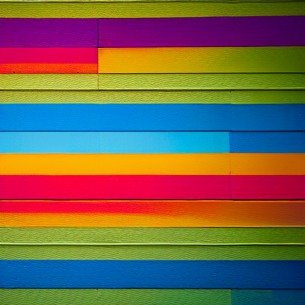

# Hallucination as art?

## Procedure

The idea is to use two generative models in parallel, feeding the output of one to the input of the other. More specifically, we start with text-to-image generation and pass a simple initial prompt (in this case, "wavy lines") to Stable Diffusion model to get an image. We then feed this to LLaVA, a language model that can take images as context and answer questions about them. In this case, we pass in the image from the current iteration and we ask "What do you see here?". The generated description becomes the prompt for the next iteration of text to image generation. and so on. 

> prompt: wavy lines

## iteration 1

> Description: a striped pattern made up of blue and gold stripes. The blue stripes are positioned horizontally, while the gold stripes are placed vertically. The pattern creates a visually appealing design, with the blue stripes appearing to be slightly lighter than the gold stripes. The stripes are arranged in a way that creates a sense of depth and dimension, making the pattern more interesting and eye-catching.

## iteration 2

> Description: a wall with a striped pattern, consisting of alternating blue and yellow stripes. The stripes are arranged in a diagonal pattern, creating a visually appealing design. The wall appears to be a part of a building, and the stripes are clearly visible, covering the entire wall.

## iteration 3

> Description: a wall with a striking pattern of blue and yellow stripes. The stripes are arranged in a way that creates a visually appealing design, with the blue stripes being wider than the yellow ones. The wall is covered in these alternating stripes, creating a vibrant and eye-catching display.

## iteration 4

> Description: a colorful and abstract design, with a predominantly blue and yellow color scheme. The blue and yellow stripes are intertwined and create a visually striking pattern. The stripes are arranged in various directions, creating a sense of depth and complexity in the design. The overall effect is a vibrant and dynamic composition that captures the viewer's attention.

## iteration 5

> Description: a colorful and intricate pattern of blue, yellow, and orange stripes. The stripes are arranged in a zigzag pattern, creating a visually appealing design. The pattern is repeated multiple times throughout the image, showcasing the vibrant colors and the intricate arrangement of the stripes. The overall scene is a captivating display of color and design.

## iteration 6

> Description: a colorful striped wallpaper with a variety of colors, including blue, green, yellow, and orange. The wallpaper is arranged in a vertical pattern, creating a visually appealing and vibrant design. The stripes are of different widths, adding depth and texture to the overall appearance. The combination of these colors and the striped pattern creates a lively and dynamic atmosphere in the room.

## iteration 7

> Description: a colorful striped wall with a variety of vibrant colors. The wall is predominantly yellow, with several other colors interspersed throughout the stripes. These colors include red, blue, green, and purple, creating a visually striking and lively pattern. The wall appears to be a part of a building, and the stripes are arranged in a way that covers the entire wall, creating a captivating and dynamic backdrop.

## iteration 8

> Description: a colorful wall with a variety of bright colors, including red, yellow, blue, green, and orange. The wall is made up of several horizontal stripes, each painted in a different color. The stripes are arranged in a visually appealing manner, creating a vibrant and lively atmosphere. The wall's design showcases a bold and creative use of color, making it an eye-catching focal point in the space.

## iteration 9

> Description: a large room with a white ceiling and walls. The walls are adorned with three large, colorful paintings, each with a different color scheme. The paintings are positioned in a way that they appear to be hanging from the ceiling, creating a visually striking display. The room also contains a few other elements, such as a chair located towards the right side of the room and a clock on the wall. The combination of the vibrant paintings and the clean, white walls creates a modern and artistic atmosphere in the room.

## iteration 10

> Description: a large, open room with a hardwood floor and white walls. The room is adorned with a collection of artwork, including a variety of paintings and pictures hanging on the walls. There are at least 12 paintings displayed in the room, showcasing different styles and colors. In addition to the artwork, the room also contains a couch situated in the left corner, providing a comfortable seating area for relaxation or conversation. The combination of the artwork and the cozy couch creates an inviting and aesthetically pleasing atmosphere in the room.

## iteration 11

> Description: a cozy living room with a black wall and a white couch placed in the center. The couch is surrounded by several pillows, adding to the comfortable atmosphere. A coffee table is situated in front of the couch, and a lamp is placed nearby, providing additional lighting. In addition to the main couch, there are two other couches in the room, one on the left side and another on the right side. A chair is also present in the room, positioned close to the right couch. The room is adorned with a collection of paintings on the walls, creating a visually appealing and artistic environment.

## iteration 12

> Description: a large, open living room with a fireplace as the focal point. The room is filled with furniture, including a couch situated near the left side of the room, a chair on the right side, and a dining table in the middle. There are also two additional chairs in the room, one near the dining table and another closer to the right side of the room. A few books are scattered around the room, with one on the dining table and another on the floor near the couch. A vase can be seen on the dining table, adding a decorative touch to the space. The room is well-lit, with natural light coming in through the windows, creating a warm and inviting atmosphere.

## iteration 13

> Description: a spacious and well-lit living room with large windows that allow natural light to fill the space. The room features two couches, one positioned against the wall and the other placed in the center of the room. A chair is also present in the room, situated near the center couch. There are several potted plants scattered throughout the room, adding a touch of greenery and life to the space. Some of the plants are placed near the windows, while others are located closer to the furniture. A vase can be seen on a surface in the room, further enhancing the room's decor. The combination of furniture, plants, and natural light creates a comfortable and inviting atmosphere in the living room.

## iteration 14

> Description: a large, modern living room with a black and white color scheme. The room is furnished with two couches, one located on the left side and the other on the right side. A coffee table is placed in the center of the room, surrounded by the couches. There are several books scattered around the room, with some placed on the coffee table and others on the floor. A vase can be seen on the right side of the room, adding a decorative touch to the space. The room also has a fireplace, which serves as a focal point and contributes to the cozy atmosphere.

## iteration 15

> Description: a cozy living room with a large window that allows natural light to fill the space. The room is furnished with a couch and a coffee table, both placed near the window. There are several potted plants in the room, with one large plant on the left side, another on the right side, and a smaller one on the coffee table. In addition to the plants, there are two vases in the room, one on the coffee table and another on the floor. A chair is also present in the room, positioned near the couch. The overall atmosphere of the living room is inviting and comfortable, with the plants and natural light creating a pleasant environment.

## iteration 16

> Description: 

## iteration 17

> Description: 

## iteration 18

> Description: 

## iteration 19

> Description: 

## iteration 20

> Description: 
